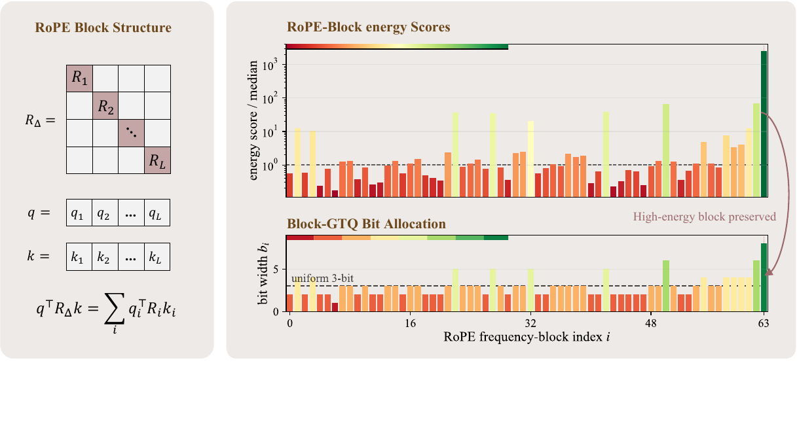
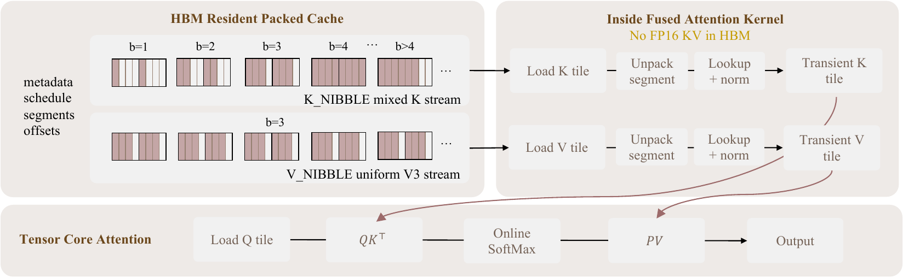
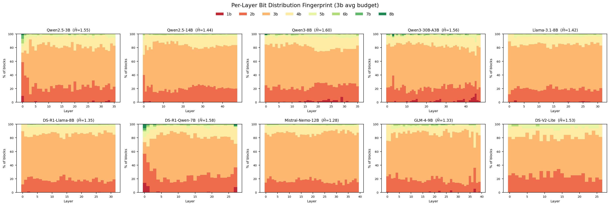
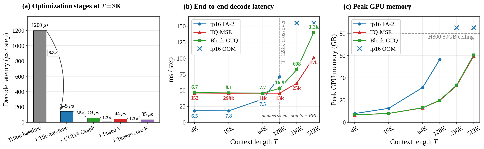

# Block-GTQ: RoPE-Aware Bit Allocation for KV-Cache Quantization

[](https://arxiv.org/abs/2606.24033)

**Block-GTQ** is a RoPE-aware bit allocator for key-cache quantization. Under
RoPE, a cached key's contribution to a future attention logit decomposes into a
position-dependent sum over 2-D frequency blocks, so a key is not used through a
flat-vector interface.Block-energy profiles can be sharply uneven (a few blocks carry most of the
query-key signal), so uniform allocation over-protects low-impact blocks and
under-protects high-impact ones. Block-GTQ computes a Q/K energy
score per block and greedily allocates integer bit widths on top of the
TurboQuant-MSE (TQ-MSE) encoder, shifting bits toward high-energy blocks under a
fixed average budget.

Illustration of Block-GTQ's RoPE-block bit allocation

Illustration of the packed-cache deployment path


## Installation

```bash
git clone https://github.com/JIA-Lab-research/blockgtq.git
cd blockgtq
conda create -n blockgtq python=3.10 -y
conda activate blockgtq
pip install -e .
```

## Quickstart

Two runnable examples:

- [`examples/quickstart_basic.py`](examples/quickstart_basic.py) — unaccelerated path.
- [`examples/quickstart_deployment.py`](examples/quickstart_deployment.py) — Accerlerated path.

## Block-GTQ across 10 diverse models

**Bit allocation.** The per-(layer, KV-head) RoPE-block allocation is non-uniform
and architecture-specific (3-bit budget). Run
[`bench/bench_perlayer_diag.py`](bench/bench_perlayer_diag.py) **once per model** —
each call calibrates that model and writes its per-layer energy/allocation and
kernel MAE; the figure below aggregates all ten:

```bash
for m in \
  Qwen/Qwen2.5-3B Qwen/Qwen2.5-14B-Instruct Qwen/Qwen3-8B Qwen/Qwen3-30B-A3B \
  meta-llama/Llama-3.1-8B-Instruct deepseek-ai/DeepSeek-R1-Distill-Llama-8B \
  deepseek-ai/DeepSeek-R1-Distill-Qwen-7B mistralai/Mistral-Nemo-Instruct-2407 \
  THUDM/glm-4-9b deepseek-ai/DeepSeek-V2-Lite; do
  python bench/bench_perlayer_diag.py --model "$m" --device cuda:0 \
      --avg-bits 3 --window-M 1024 --out-tag "$(basename "$m")"
done
```



**Per-layer kernel MAE** — Block-GTQ beats uniform TQ-MSE on all 367/367 layers (32–80% reduction):

| Model | TQ-MSE | Block-GTQ | Δ | Wins |
|---|---|---|---|---|
| Qwen2.5-3B | 6.43 | **3.23** | +49.9% | 36/36 |
| Qwen2.5-14B | 4.14 | **2.61** | +37.1% | 48/48 |
| Qwen3-8B | 5.81 | **2.96** | +49.0% | 36/36 |
| Qwen3-30B-A3B | 6.76 | **3.00** | +55.6% | 48/48 |
| Llama-3.1-8B | 3.80 | **2.55** | +32.7% | 32/32 |
| DeepSeek-R1-Distill-Llama-8B | 3.44 | **2.33** | +32.2% | 32/32 |
| DeepSeek-R1-Distill-Qwen-7B | 11.44 | **2.40** | +79.1% | 28/28 |
| Mistral-Nemo-12B | 3.46 | **2.28** | +34.2% | 40/40 |
| GLM-4-9B | 7.30 | **4.51** | +38.2% | 40/40 |
| DeepSeek-V2-Lite | 6.01 | **3.87** | +35.5% | 27/27 |

## Calibration

Block-GTQ allocates K-cache bits per (layer, KV-head) from a label-free Q/K energy
score over RoPE frequency blocks. [`examples/build_calib_cache.py`](examples/build_calib_cache.py)
computes this once per model — a single forward pass over a short text window — and
saves the Q/K activations the allocator needs:

```bash
python examples/build_calib_cache.py \
    --model meta-llama/Llama-3.1-8B-Instruct --n-tokens 2048 \
    --out calib_llama31_8b.pt
```

The default source is the bundled `calib_data/wikitext2_calib_2k.txt` (WikiText-2, 'test' split). To calibrate from a different corpus, point
`--prompt-file` at any plain-text file, or pull a WikiText-2 split directly from HF:

```bash
# any plain-text corpus — PG-19, C4, code, domain-specific text, ...
python examples/build_calib_cache.py \
    --model meta-llama/Llama-3.1-8B-Instruct --n-tokens 2048 \
    --prompt-file /path/to/corpus.txt --out calib_llama31_8b_custom.pt
```
The resulting `.pt` is reused by the NIAH and LongBench benchmarks below (via
`--calib-cache`). The AIME path calibrates inline from this same default
corpus.


## NIAH
Six-task Needle-In-A-Haystack ([`bench/bench_niah.py`](bench/bench_niah.py)), using a
calibration cache from the [Calibration](#calibration) step:

```bash
python bench/bench_niah.py \
    --model meta-llama/Llama-3.1-8B-Instruct --device cuda:0 \
    --context-lengths 4096 8192 16384 32768 65536 131072 \
    --k-bits 2 --v-bits 2 \
    --tasks single distractor multi multikey multivalue multiquery \
    --calib-cache calib_llama31_8b.pt --n-trials 3
```

## LongBench

LongBench-EN ([`bench/bench_longbench.py`](bench/bench_longbench.py)) — download the data from [THUDM/LongBench](https://huggingface.co/datasets/THUDM/LongBench), point `$LONGBENCH_DATA_DIR` at it, and reuse the calibration cache from above:

```bash
LONGBENCH_DATA_DIR=/path/to/longbench/data \
python bench/bench_longbench.py \
    --model meta-llama/Llama-3.1-8B-Instruct \
    --calib-cache calib_llama31_8b.pt --k-bits 3 --v-bits 3 \
    --subtasks qasper hotpotqa multifieldqa_en passage_retrieval_en
```

## AIME

AIME 2024/2025 ([`bench/bench_aime.py`](bench/bench_aime.py)), no-buffer and
with-buffer settings. 

```bash
# no-buffer (every key quantized)
python bench/bench_aime.py \
    --model deepseek-ai/DeepSeek-R1-Distill-Qwen-7B \
    --datasets aime24 aime25 --k-bits <K_BITS> --v-bits <V_BITS> \
    --methods fp16 Block-GTQ TQ-MSE --setting nobuffer --seeds <Seeds>

# with-buffer (sink=4, recent fp16 window=128)
python bench/bench_aime.py \
    --model deepseek-ai/DeepSeek-R1-Distill-Qwen-7B \
    --datasets aime24 aime25 --k-bits <K_BITS> --v-bits <V_BITS> \
    --methods fp16 Block-GTQ TQ-MSE --setting withbuffer --seeds <Seeds>
```

## Deployment

Packed-cache decode vs. fp16 FlashAttention-2 (single H800, Qwen2.5-3B-Instruct, K3V3):




```bash
# T <= 128K -- fp16 + Block-GTQ + TQ-MSE
python bench/bench_decode_e2e.py --configs K3V3 \
    --t-points 4096 16384 65536 131072 \
    --measure-ppl --ppl-tokens 1000 --prewarm-kernel

# T = 256K, 512K -- Block-GTQ + TQ-MSE (fp16 OOMs)
python bench/bench_decode_e2e.py --configs K3V3 \
    --t-points 262144 524288 \
    --measure-ppl --ppl-tokens 1000 --skip-fp16 --prewarm-kernel
```

## Hardware support

The Block-GTQ **algorithm is platform-independent** — calibration, bit allocation, and
the quantize/dequantize path use only portable PyTorch + Triton, so the quality results
(NIAH / LongBench / AIME) reproduce on any CUDA GPU via the reference (quantize → SDPA)
path. The **fused decode kernel** — the production latency / memory path — is shipped
per backend:

| Backend | Fused decode kernel |
|---|---|
| Hopper (H800 / SM90) | ✅ benchmarked — the paper's latency / memory numbers |
| Turing (2080 Ti / SM75) | ⏳ planned |
| Apple MLX (M-series) | ⏳ planned |

Contributions for the Turing and Apple-MLX kernels are welcome.

## Citation

```bibtex
@article{blockgtq2026,
  title  = {RoPE-Aware Bit Allocation for KV-Cache Quantization},
  author = {Fengfeng Liang and Yuechen Zhang and Jiaya Jia},
  journal= {arXiv preprint arXiv:2606.24033},
  year   = {2026}
}
```


